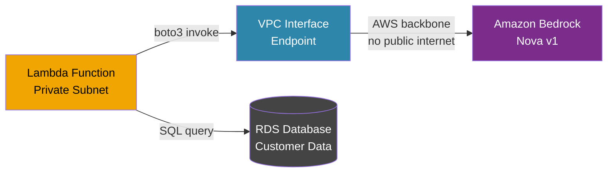
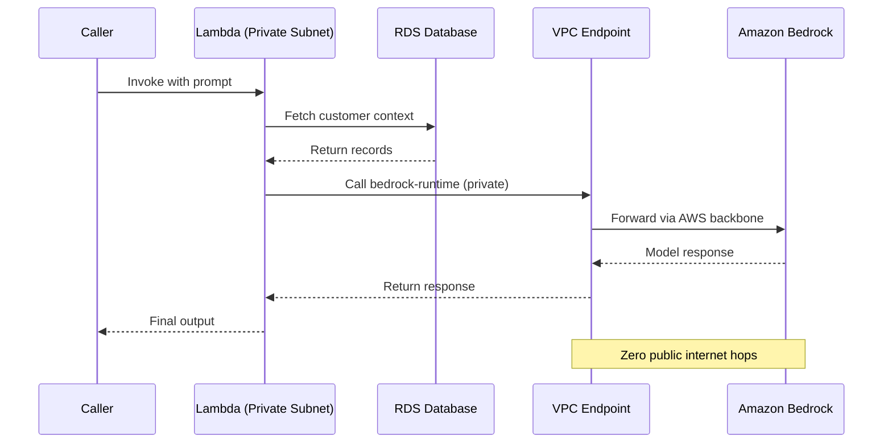

# Private Bedrock Access via AWS PrivateLink

   

A production-grade pattern for invoking Amazon Bedrock foundation models from **private VPC subnets** — without exposing sensitive data to the public internet.

Most GenAI tutorials call Bedrock over the public internet. In regulated industries — healthcare, finance, enterprise — that is not an option. This project implements the correct production pattern: private LLM inference with zero public network exposure.

---

## Problem

| Pain Point | Without PrivateLink | With PrivateLink |
|---|---|---|
| Lambda in private subnet | Bedrock call times out silently after 60s | Works seamlessly |
| PII / PHI in prompt | Travels over public internet | Never leaves AWS backbone |
| HIPAA / SOC2 audit | Fails network controls check | Passes private routing requirement |
| NAT Gateway cost | $0.045/GB data transfer | VPC Endpoint ~$0.01/hr flat fee |
| Compliance posture | Must justify internet exposure | No internet exposure to justify |

---

## Architecture



**The core insight:** Moving Lambda into a private subnet cuts off public internet access. This is intentional for security — but it also blocks the default Bedrock API endpoint. A VPC Interface Endpoint bridges that gap entirely within AWS's private network.

---

## How It Works



---

## Project Structure

```
private-bedrock-vpc/
├── lambda/
│   ├── lambda_function.py     # Entry point — routes prompt through private call
│   └── bedrock.py             # Boto3 invocation of Nova Micro model
├── iam_policy.json            # Least-privilege execution role policy
├── vpc_endpoint_policy.json   # Resource policy scoped to specific IAM role
└── README.md
```

---

## Setup

### Prerequisites
- AWS account with Bedrock Nova Micro access enabled
- Existing VPC with at least one private subnet (no `0.0.0.0/0` internet route)
- Lambda execution role with permissions from `iam_policy.json`

### 1. Deploy Lambda into Private Subnet

| Setting | Value |
|---|---|
| Runtime | Python 3.12 |
| VPC | Your private VPC |
| Subnet | Private subnet only |
| Security Group | Outbound TCP 443 allowed |

### 2. Create VPC Interface Endpoint

```
Service  :  com.amazonaws.us-east-1.bedrock-runtime
VPC      :  Your private VPC
Subnet   :  Same private subnet as Lambda
Policy   :  Attach vpc_endpoint_policy.json
```

> Without this endpoint, Lambda will time out silently with no error when calling Bedrock — the request simply never arrives.

### 3. Set Environment Variables

```bash
BEDROCK_MODEL_ID=amazon.nova-micro-v1:0
```

### 4. Test

```json
{
  "prompt": "Summarize the risks of exposing LLM traffic over public internet."
}
```

---

## Security Design

**Least-privilege IAM** — `iam_policy.json` grants `bedrock:InvokeModel` only for the specific model ARN. No wildcard resources.

**Scoped endpoint policy** — `vpc_endpoint_policy.json` restricts which IAM role can use the VPC endpoint. Network access alone is not enough to invoke the model.

**No NAT Gateway** — deliberately omitted. NAT would reintroduce public routing and break the security model entirely.

**Security Group as inner control** — only resources sharing the security group can reach the VPC endpoint. Defense in depth.

---

## Stack

| Layer | Technology |
|---|---|
| Compute | AWS Lambda (Python 3.12) |
| LLM | Amazon Bedrock — Nova Micro v1 |
| Private Connectivity | AWS PrivateLink |
| Network Entry Point | VPC Interface Endpoint |
| AWS SDK | Boto3 |
| Network Isolation | Amazon VPC |

---

## Real-World Use Cases

This pattern is required in:
- **Healthcare AI** — PHI in prompt must never traverse public internet (HIPAA §164.312)
- **Financial services** — transaction data sent to LLM for fraud analysis or reporting
- **Enterprise RAG** — private vector DB + private LLM inference in the same VPC
- **Agentic systems** — multi-step agents operating on internal confidential data

---


## Author

Abhishek Kumar — [LinkedIn](https://linkedin.com/in/abhishek-k-16239ba7/)
